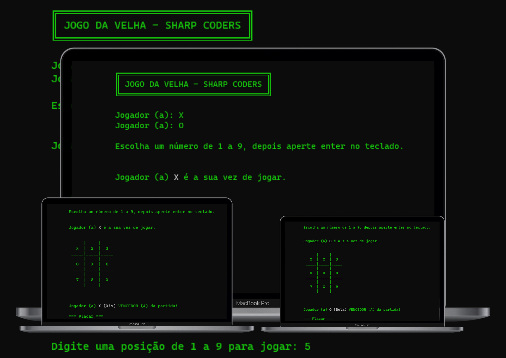

<h1 align="center"> SHARP CODERS | Projeto Jogo da velha C# - 2022 </h1>

Formação Desenvolvedor C#, promovido pela Imã Learning Place | Sharp Coders.

  <a href="#-tecnologias">Tecnologias</a>&nbsp;&nbsp;&nbsp;|&nbsp;&nbsp;&nbsp;
  <a href="#-teacher">Teacher</a>&nbsp;&nbsp;&nbsp;|&nbsp;&nbsp;&nbsp;
  <a href="#-bootcamp">Bootcamp</a>&nbsp;&nbsp;&nbsp;|&nbsp;&nbsp;&nbsp;
  <a href="#memo-licença">Licença</a>

  

 

  

## 🚀 Tecnologias

Esse projeto foi desenvolvido com as seguintes tecnologias:

- C#
- Git e Github

## 🎓 Teacher

- Agradeço pela oportunidade de crescimento e ótima didática do prof. Hugo Rafael  

## 💻 Bootcamp

- FullStack na [**Ímã learning place**](https://imalearningplace.com) | Sharp Coders 2022
- C# focado em Lógica de Programação e Algoritmos

## :memo: Licença

- Esse projeto está sob a licença MIT

